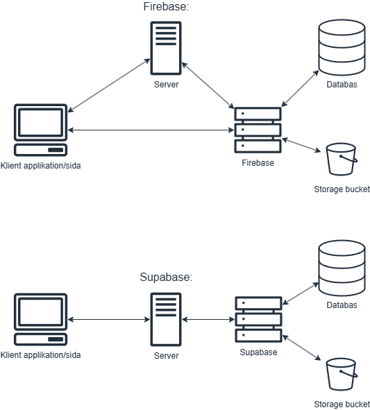

# Kandidatprojekt 2025

Studenter vid Linköpings universitets medieteknikprogram stöter ofta på utmaningar när det gäller att hålla koll på sina studieresultat och planera sin studiegång. Detta kan skapa osäkerhet kring vilka kurser som bör prioriteras och försvåra uppfyllandet av CSN:s krav för studiemedel. I detta projekt undersöker vi hur en webbaserad plattform kan hjälpa studenter genom att samla relevant statistik och ge rekommendationer anpassade efter deras individuella behov. Plattformen visualiserar studentens framsteg mot examen, erbjuder insikter om tentastatistik och hjälper till att effektivt prioritera studierna.

---

## Bytt från Firebase till Supabase

Vi har nu bytt från Firebase till supabase, detta för att Firebase fungerar bättre för att endast köras på frontenden och inte lika mycket på backend delar utav webbprojekt. För en bättre över blick se följande illustration:



Detta gör även att det kan finnas kvar kodrester från när Firebase implementerades till projektet, dessa håller på att tas bort för att inte skapa förvirring.

## Installationsguide (första gången)

För att komma igång med projektet, kör följande kommandon:

```console
npm install
npm run dev
```

**Viktigt:** Detta kommer inte att fungera utan filen **.env.local**!

---

## Dokumentation för bibliotek

Här hittar du länkar till dokumentation för de bibliotek och plugins vi använder i projektet:

### TailwindCSS

- [Tailwind Dokumentation](https://tailwindcss.com/docs/)
- [Tailwind Spacing Chart](https://tailwindcss.com/docs/customizing-spacing)
- [Tailwind Färger](https://tailwindcss.com/docs/customizing-colors)

### Ikoner

- [Lucide Ikoner](https://lucide.dev/)

### Shadcn/aceternity (UI)

- [Komponenter (Shadcn)](https://ui.shadcn.com/docs/components/accordion)
- [Komponenter (ui.aceternity)](https://ui.aceternity.com/)
- [Grafer](https://ui.shadcn.com/charts)

---

### Rekommenderade VS Code-tillägg

- [Filikoner](https://marketplace.visualstudio.com/items?itemName=tal7aouy.icons)
- [Prettier Formatting](https://marketplace.visualstudio.com/items?itemName=esbenp.prettier-vscode)
  **_Detta kan du även ändra enligt dina egna preferenser_**
  
- [Tailwind IntelliSense](https://marketplace.visualstudio.com/items?itemName=bradlc.vscode-tailwindcss)
- [Headwind](https://marketplace.visualstudio.com/items?itemName=heybourn.headwind)

---

## Figma Design

Följ den här länken för att komma åt Figma-designen för projektet:

[Figma länk](https://www.figma.com/design/xFmuAvVpI5714AzzsBwDYI/Vart-%C3%A4r-mitt-CSN?node-id=0-1&p=f&t=jAgwB2QnENzXwnjn-0)
