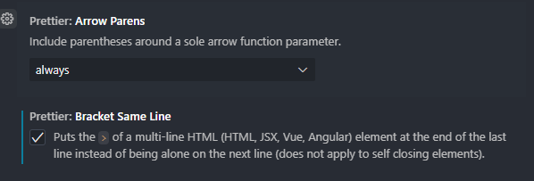

# Kandidatprojekt - 2025

Många studenter vid Linköpings universitets medieteknikprogram upplever svårigheter med att hålla koll på sina studieresultat och planera sin studiegång. Detta kan leda till osäkerhet kring vilka kurser som är viktigast att prioritera och svårigheter med att uppfylla CSN:s krav för studiemedel. Projektet undersöker hur en webbaserad plattform kan underlätta för studenter genom att samla relevant statistik och ge rekommendationer baserat på deras individuella situation. Plattformen visualiserar studentens framsteg mot examen, ger insikter om tentastatistik och hjälper dem att prioritera sina studier effektivt.

---

## Hur du kör projektet

För att kunna köra projektet behöver följande steg göras

### Installationer

```console
npm install
npm install -g firebase-tools
npm install --save @types/js-cookie

// För windows behöver man följande
npm install --save-dev cross-env'
```

### Emulator/körning
```console
npm run emulators
npm run dev
```

#### Viktigt att veta
Projektet kommer inte kunna gå att köra utan dessa filer:
- **.env.local** 
- **.env.development**
- **serviceAccount.json**

---

## Dokumentation till library

Lite diverse länkar till dokumentation för de olika librarys/plugins vi använder

> ### TailwindCSS
>
> - [Tailwind Dokumentation](https://tailwindcss.com/docs/)
> - [Tailwind Spacing Chart](https://tailwindcss.com/docs/customizing-spacing)
> - [Tailwind Färger](https://tailwindcss.com/docs/customizing-colors)

> ### Ikoner
>
> - [Lucide](https://lucide.dev/)

> ### Shadcn/ui
>
> - [Komponenter](https://ui.shadcn.com/docs/components/accordion)
> - [Grafer](https://ui.shadcn.com/charts)

### Rekomenderade VS Code tillägg

> - [Fil ikoner](https://marketplace.visualstudio.com/items?itemName=tal7aouy.icons)
> - [Prettier formatting](https://marketplace.visualstudio.com/items?itemName=esbenp.prettier-vscode)
>
>   **_Ändra helst detta också_**
>   
>   
>
> - [Tailwind IntelliSense](https://marketplace.visualstudio.com/items?itemName=bradlc.vscode-tailwindcss)
> - [Headwind](https://marketplace.visualstudio.com/items?itemName=heybourn.headwind)

[Figma länk](https://www.figma.com/design/xFmuAvVpI5714AzzsBwDYI/Vart-%C3%A4r-mitt-CSN?node-id=0-1&p=f&t=jAgwB2QnENzXwnjn-0)
